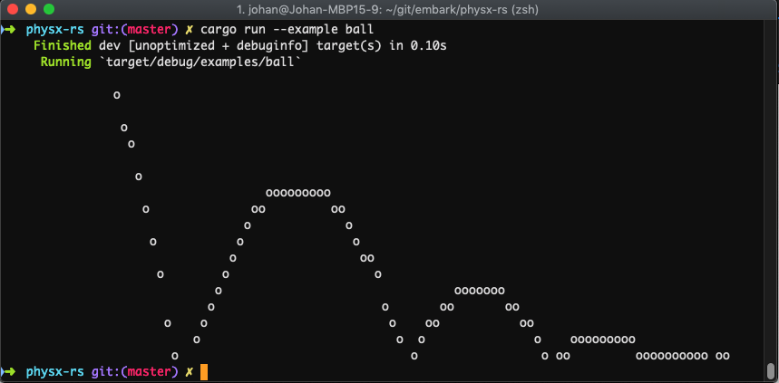

<div align="center">

# `🎳 physx-rs`

**Rust binding for [NVIDIA PhysX](https://github.com/NVIDIAGameWorks/PhysX), a popular and mature physics engine well-suited for games**

[](https://embark.dev)
[](https://discord.gg/dAuKfZS)
[](https://crates.io/crates/physx)
[](https://docs.rs/physx)
[](https://deps.rs/repo/github/EmbarkStudios/physx-rs)
[](https://github.com/EmbarkStudios/physx-rs/actions)

</div>

Created and maintained by [Embark](http://embark.games) and _**not**_ officially supported by NVIDIA.

This repository contains 2 crates:

| Name | Description | Links |
| --- | --- | --- |
| [`physx`](physx/) | High-level interface on top of `physx-sys` 🚧 | [](https://crates.io/crates/physx) [](https://docs.rs/physx) |
| [`physx-sys`](physx-sys/) | Unsafe bindings to the [PhysX C++ API](https://github.com/NVIDIAGameWorks/PhysX) | [](https://crates.io/crates/physx-sys) [](https://docs.rs/physx-sys) |

## Why use it?

* You want a feature-rich and performant physics engine to use in your project.

## Caveats

* The high-level `physx` wrapper is work-in-progress, and only covers a part of PhysX functionality. You can follow our progress and see where contributions are needed in our [*Tracking Issue for High-Level API Completeness*](https://github.com/EmbarkStudios/physx-rs/issues/5).

* Any other features have to be accessed through the unsafe [physx-sys](physx-sys/) crate.

* It's a large C++ codebase which requires a C++ toolchain, and comes with a non-trivial build system.

### Alternatives

* [Rapier](https://github.com/dimforge/rapier): a 2D and 3D physics engine for games, animation, and robotics written in Rust.  Fully cross-platform, with web support and optional cross-platform determinism on IEEE 754-2008 compliant systems.

* [nphysics](https://github.com/dimforge/nphysics): a 2- and 3-dimensional physics engine for games and animations written in Rust. It is a good option for projects which do not require the full feature set of PhysX or prefer a native Rust solution.

## Presentation

[Tomasz Stachowiak](https://github.com/h3r2tic) did a presentation at the Stockholm Rust Meetup on October 2019 about this project that goes through the tecnical details of how C++ to Rust bindings of `physx-sys` works:

[](http://www.youtube.com/watch?v=RxtXGeDHu0w)

## Usage

The following code example shows how [`physx`](physx/) can be initialized.

``` rust
const PX_PHYSICS_VERSION: u32 = physx::version(4, 1, 1);
let mut foundation = Foundation::new(PX_PHYSICS_VERSION);

let mut physics = PhysicsFoundation::default();

let mut scene = physics.create(
    SceneDescriptor {
        gravity: PxVec3::new(0.0, 0.0, -9.81),
        ..SceneDescriptor::new(MySceneUserData::default())
    }
);

```

You can run an example with `cargo run --example ball`, which should show the following output:



Information about all wrapper functionality can be found in the [physx](physx/) crate docs.

If you require functionality not covered by the [physx](physx/) wrapper you can use the low level [physx-sys](physx-sys) crate, which closely maps to the official PhysX SDK. You can find the PhysX user guide [here](https://gameworksdocs.nvidia.com/PhysX/4.1/documentation/physxguide/Manual/Introduction.html).

## Prerequisites

* C++ compiler ([see the `cc` crate](https://crates.io/crates/cc) for requirements)

## How to build

```bash
git submodule update --init
cargo build --release
```

## Windows Note

It is highly recommended to not enable debug info in release mode when building with MSVC, as the Physx C++ code will take an **extremely** long time to compile. You can disable this by putting the following in your Cargo.toml

```ini
[profile.release.package.physx-sys]
debug = false
```

## How to release (maintainers only)

1. Install [cargo-release](https://github.com/sunng87/cargo-release#install)
2. Look at `physx/CHANGELOG.md` and `physx-sys/CHANGELOG.md` to determine whether both or only one of the crate needs updating, and what [semantic version](https://semver.org/) bump we need
3. Review the list of changes in the changelogs and compare with the git commit diffs to the previous release and make sure we've captured and described all changes well and that they are semantically correct
4. Run `cargo release --manifest-path <physx|physx-sys>/Cargo.toml <major|minor|patch>` to automatically update the CHANGELOG, publish, tag, and push the release. If you are publishing both `physx` and `physx-sys`, you can just add the `--skip-push` flag to avoid pushing each crate individually and then do `git push --follow-tags` to push both at the same time.

## Contributing

[](../CODE_OF_CONDUCT.md)

We welcome community contributions to this project.

Please read our [Contributor Guide](CONTRIBUTING.md) for more information on how to get started.

## License

Licensed under either of

* Apache License, Version 2.0, ([LICENSE-APACHE](LICENSE-APACHE) or <http://www.apache.org/licenses/LICENSE-2.0>)
* MIT license ([LICENSE-MIT](LICENSE-MIT) or <http://opensource.org/licenses/MIT>)

at your option.

Note that the [PhysX C++ SDK](https://github.com/NVIDIAGameWorks/PhysX) has its [own BSD 3 license](https://gameworksdocs.nvidia.com/PhysX/4.1/documentation/physxguide/Manual/License.html) and depends on [additional C++ third party libraries](https://github.com/NVIDIAGameWorks/PhysX/tree/4.1/externals).

### Contribution

Unless you explicitly state otherwise, any contribution intentionally
submitted for inclusion in the work by you, as defined in the Apache-2.0
license, shall be dual licensed as above, without any additional terms or
conditions.
